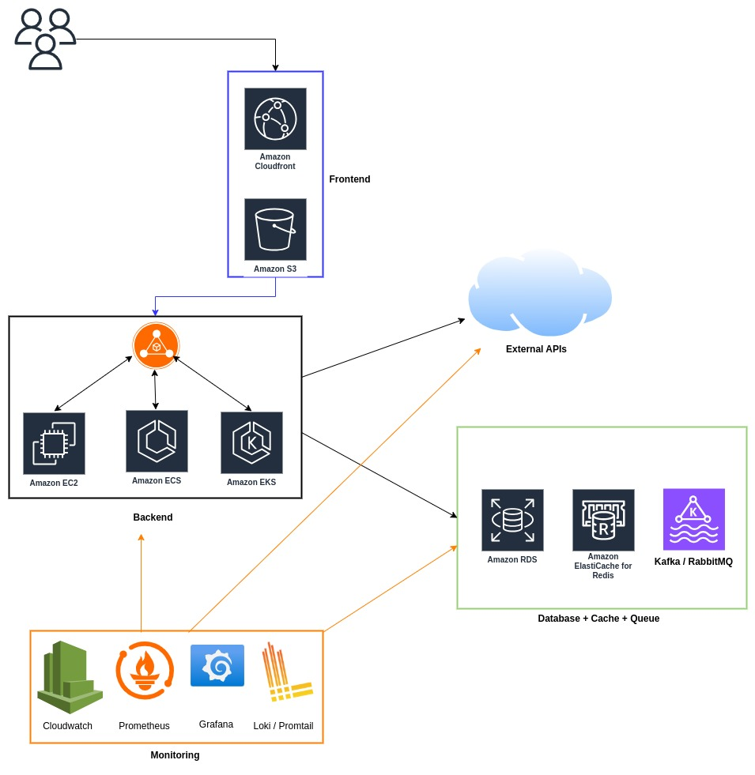

# Scalable E-Commerce Cloud Architecture

## Overview

This architecture is designed to scale an e-commerce application to handle millions of global user requests while maintaining cost efficiency, high availability, and low latency.

---

## 🌍 Key Requirements Addressed

- **Scalable Backend**: Handles different types of read and write APIs using EC2, ECS, and EKS for compute flexibility.
- **Background Job Processing**: Kafka and RabbitMQ enable asynchronous processing of long-running tasks like order processing etc.
- **Global Traffic Support**: CloudFront ensures fast, cached content delivery worldwide. The design is extendable for multi-region support.
- **External Integrations**: The system interacts with third-party product APIs for dynamic inventory and product updates.

---

## 📦 Components

### 🔹 Frontend
- **Amazon S3**: Hosts the static frontend.
- **Amazon CloudFront**: Caches and distributes the content to users globally.

### 🔹 Backend
- **Amazon EC2 / ECS / EKS**: Scalable compute layers to run backend services based on API types and workloads (All with autoscaling enabled to handle millions of traffic).
- **API Gateway / ALB**: Can be included for routing and securing APIs (not explicitly shown in the diagram).

### 🔹 Data Layer
- **Amazon RDS**: Stores structured, transactional data.
- **Amazon ElastiCache (Redis)**: Caches frequent queries and product data for low-latency access.
- **Kafka / RabbitMQ**: Handles background tasks and async processing.

### 🔹 External APIs
- Fetch product lists and other dependencies from third-party systems using scheduled or event-driven sync.

### 🔹 Monitoring & Observability
- **CloudWatch**: Native AWS monitoring for infrastructure.
- **Prometheus + Grafana**: Custom metrics and visualizations.
- **Loki / Promtail**: Centralized logging and log aggregation.

---

## ⚙️ Scaling Considerations

- **Auto Scaling Groups** for EC2 instances.
- **Cluster AutoScaler** for EKS.
- **Horizontal Pod Autoscaling** for Kubernetes workloads.
- **Caching** to reduce DB pressure.
- **CDNs** to minimize repeated asset delivery.
- **Async Job Queues** to defer non-critical operations.

---

## 💡 Future Enhancements

- Multi-region deployment using Route 53 latency-based routing.
- Global Accelerator for faster failover and reduced latency.
- CI/CD pipeline using CodePipeline, GitHub Actions, or Jenkins.
